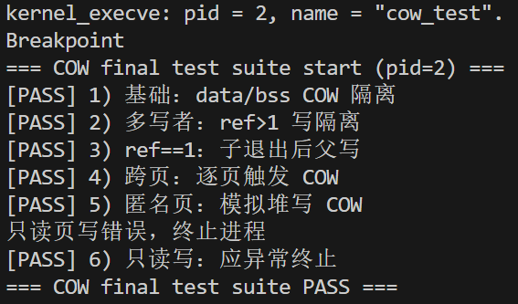
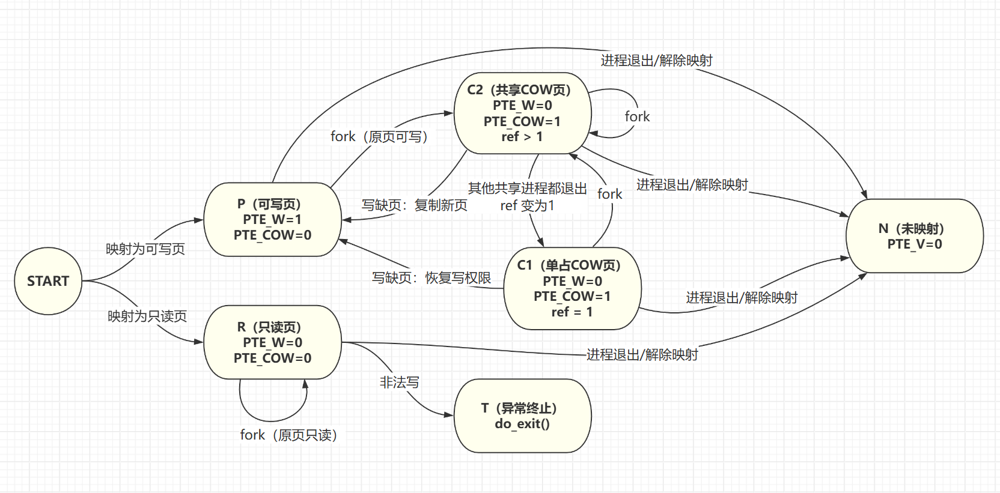
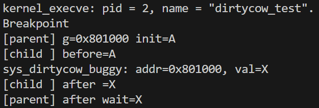
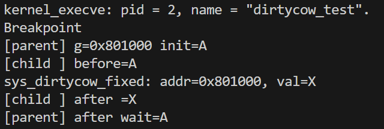

# 操作系统课程ucore Lab5

## 练习0：填写已有实验

已实现。

## 练习1：加载应用程序并执行

### Q1：补充`load_icode`的第6步

> **补充`load_icode`的第6步，建立相应的用户内存空间来放置应用程序的代码段、数据段等，且要设置好`proc_struct`结构中的成员变量`trapframe`中的内容，确保在执行此进程后，能够从应用程序设定的起始执行地址开始执行。设置正确的`trapframe`内容。**

**`do_execve`**函数调用`load_icode`函数来**加载**并**解析**一个处于内存中的**ELF**执行文件格式的应用程序。我们要补充的就是`load_icode`函数中的第六步。

在此之前，`load_icode`函数已经实现了以下的五个步骤：

- 创建一个新的`mm`
- 创建新的`PDT`
- 加载**elf**文件（text/data/bss等）
- 构建用户栈
- 切换地址空间（页表）

然后到了我们需要补充的步骤：初始化新用户环境的`trapframe`。首先，回顾`trapframe`结构：

```c
struct trapframe
{
    struct pushregs gpr;
    uintptr_t status;
    uintptr_t epc;
    uintptr_t tval;
    uintptr_t cause;
};
```

`trapframe`的结构如上；下面我们需要设置`tf->gpr.sp, tf->epc, tf->status`。我们用了四行代码来设置这三个值，代码如下：

```c
    /* should set tf->gpr.sp, tf->epc, tf->status
     * NOTICE: If we set trapframe correctly, then the user level process can return to USER MODE from kernel. So
     *          tf->gpr.sp should be user stack top (the value of sp)
     *          tf->epc should be entry point of user program (the value of sepc)
     *          tf->status should be appropriate for user program (the value of sstatus)
     *          hint: check meaning of SPP, SPIE in SSTATUS, use them by SSTATUS_SPP, SSTATUS_SPIE(defined in risv.h)
     */
    tf->gpr.sp = USTACKTOP;
    tf->epc = elf->e_entry;
    tf->status = sstatus & ~SSTATUS_SPP;
    tf->status |= SSTATUS_SPIE;

    ret = 0;
```

下面是他们的详细解释。

- `tf->gpr.sp`。`tf->gpr.sp = USTACKTOP`设置了用户栈指针，`USTACKTOP` 是用户栈的顶部地址。
- `tf->epc`。`tf->epc = elf->e_entry`设置了程序入口点，`elf->e_entry` 是ELF文件头中记录的程序入口地址，这个地址会被加载到`sepc`寄存器。
- `tf->status`。`tf->status = sstatus & ~SSTATUS_SPP`语句用来清除`SPP`位（为0表示返回用户态），`SSTATUS_SPP`表示触发异常前的特权级：0 = 用户态 (U-mode)，1 = 内核态 (S-mode)。`tf->status |= SSTATUS_SPIE`语句用来设置`SPIE`位。`SPIE`保存了触发异常前的中断使能状态，执行 `sret` 后，`SPIE`的值会被复制到`SIE`位，恢复中断使能。这样用户程序就可以正常响应中断了。

### 附：用户进程创建流程：

- 首先，创建用户进程。通过`kernel_thread()`函数里面，调用`do_fork()`、`copy_thread()`方法，设置新进程的内核栈上下文。

- 调用`kernel_execve()`函数，加载用户程序。我们需要利用中断机制，这里面主要触发了一个`ebreak`（不用`ecall`的原因是，目前我们在 `S mode` 下，所以不能通过 `ecall` 来产生中断。我们这里采取一个取巧的办法，用 `ebreak` 产生断点中断进行处理，通过设置 `a7` 寄存器的值为10 （**特殊标识**）说明这不是一个普通的断点中断，而是要转发到 `syscall()`）。`trap.c`的`exception_handler()`函数中，对这个逻辑进行了判断：

	```c
	case CAUSE_BREAKPOINT:
	    cprintf("Breakpoint\n");
	    if (tf->gpr.a7 == 10)//判断
	    {
	        tf->epc += 4; //跳过ebreak指令，防止死循环
	        syscall(); //调用syscall()
	        kernel_execve_ret(tf, current->kstack + KSTACKSIZE);
	    }
	```

	其中的`kernel_execve_ret()`函数，它负责复制`trapframe`到新的栈顶，并且正常返回用户态。

- 中断返回后，调用`sys_exec()`函数，它又会调用`do_execve()`函数，它会清空当前的进程内存空间，再调用`load_icode()`函数，来为新的进程加载内容（具体流程在Q1中已经介绍）。

### Q2：简要描述这个用户态进程被ucore选择占用CPU执行（RUNNING态）到具体执行应用程序第一条指令的整个经过

- 经过时钟中断、调度器选中后，这个用户态进程被选择占用CPU执行了。那么需要调用`proc_run()`函数，让进程真正“跑起来”。

	当需要切换进程时，`proc_run()`函数会执行以下内容：

	```c
	bool intr_flag;
	local_intr_save(intr_flag); //禁用中断
	struct proc_struct *prev = current;
	current = proc;
	lsatp(proc->pgdir); //切换页表，使用进程自己的虚拟地址空间
	switch_to(&(prev->context), &(proc->context)); //切换上下文
	local_intr_restore(intr_flag);//启用中断
	```

	先禁用中断（结束后再启用），然后切换页表、切换上下文。

- `switch_to`中，保存旧进程的上下文，恢复新进程的上下文。然后，调用`ret`，跳转到`ra`（即`forkret`函数）。再`forkrets`汇编方法中，先进行 `move sp, a0`，将栈指针设置为指向`trapframe`；然后执行`j __trapret`跳到`__trapret`方法。`__trapret`中，进行`RESTORE_ALL` 恢复所有寄存器，然后执行`sret`返回用户态。

- `sret`后，硬件完成以下操作：PC从`sepc`（被设为`elf->e_entry`）中读取值（即下一条指令对应了应用程序的**第一条指令**了）；

	特权级设为`sstatus.SPP`（0，用户态），再把`sstatus.SPP`置0；`SIE`设为`sstatus.SPIE`（1，开启中断），再把`sstatus.SPIE`置1。

至此，CPU下一条就开始执行程序的**第一条**指令了。


## 练习2：父进程复制自己的内存空间给子进程

> **创建子进程的函数`do_fork`在执行中将拷贝当前进程（即父进程）的用户内存地址空间中的合法内容到新进程中（子进程），完成内存资源的复制。具体是通过`copy_range`函数（位于kern/mm/pmm.c中）实现的，请补充`copy_range`的实现，确保能够正确执行。**

创建用户子进程时，会通过系统调用 `sys_fork()` 调用对应内核函数 `do_fork()`，我们的期望是子进程要拥有一份和父进程一样的用户地址空间，而 `do_fork()` 完整流程是：

1. `alloc_proc()`：分配并初始化 PCB（`proc_struct`）
2. `setup_kstack()`：给子进程分配内核栈（内核态运行必须）
3. **`copy_mm(clone_flags, proc)`：复制/共享内存管理结构 mm**
4. `copy_thread(proc, stack, tf)`：准备子进程的 trapframe 和 context
5. `hash_proc(proc)` + `set_links(proc)`：加入系统进程集合并建立父子关系
6. `wakeup_proc(proc)`：把子进程设为 runnable
7. 返回子进程 pid 给父进程

其中`copy_mm()` 在完成 `mm_struct` 和页目录的创建后，会调用 `dup_mmap()` 遍历父进程的所有 `vma`，并在每一个 `vma` 的地址范围内调用 `copy_range()`。

> 在 uCore 中，每个用户进程都有一个 `mm_struct`，用于描述该进程的**完整虚拟地址空间**：
>
> - `mm_struct` 中维护了：
> 	- 页目录（`pgdir`）
> 	- 一组 `vma_struct`（虚拟内存区域）
> - 每个 `vma_struct` 描述了一段合法的虚拟地址区间 `[vm_start, vm_end)`，例如代码段、数据段、堆、用户栈等。
>
> 在 fork 过程中，复制用户地址空间（也就是整个 `copy_mm` 函数）的本质就是：
>
> **为子进程重新构造一套 vma + 页表，并将父进程 vma 覆盖范围内的所有有效虚拟页逐页复制。**

`copy_range()` 是本实验需要补充实现的关键函数，它负责在给定的虚拟地址区间 `[start, end)` 内，逐页复制父进程的用户内存。

其核心实现逻辑如下：

1. **按页遍历虚拟地址区间**

	```
	start % PGSIZE == 0 && end % PGSIZE == 0
	```

	保证复制以页为单位进行。

2. **在父进程页表中查找虚拟页映射**

	使用 `get_pte(from, start, 0)` 查找父进程在该虚拟地址处是否存在有效 PTE：

	- 若不存在，说明该页未映射，跳过；
	- 若存在且有效，则需要复制该页。

3. **为子进程分配新的物理页**

	```
	struct Page *npage = alloc_page();
	```

	子进程不能直接使用父进程的物理页，否则会破坏进程间的内存隔离。

4. **复制页内容并建立子进程的页表映射（我们补充实现的具体内容）**

	`src_kvaddr = page2kva(page);`

	- `page` 是父进程对应的某个物理页
	- `page2kva` 把它转换成 **内核可直接访问的虚拟地址**

	`dst_kvaddr = page2kva(npage);`

	- `npage` 是刚分配给子进程的新物理页
	- 同样转成内核地址，才能写入

	`memcpy(dst_kvaddr, src_kvaddr, PGSIZE);`

	- **复制整页内容（4KB）**
	- 这一步保证子进程拿到一份“与父进程一致”的内存快照

	`page_insert(to, npage, start, perm);`

	- 在子进程页表 `to` 中，把子物理页 `npage` 映射到相同的虚拟地址 `start`
	- `perm` 是父页的用户权限位（读写执行 U 等），子进程也与其保持一致


## 练习3：阅读分析源代码，理解进程执行fork/exec/wait/exit的实现，以及系统调用的实现

系统调用是用户程序请求操作系统服务的唯一途径，在ucore中，系统调用的完整流程如下：

```
[用户态]                    [内核态]
用户程序
  ↓
库函数封装 (fork/exec/wait/exit)
  ↓
sys_xxx() 函数
  ↓
syscall() 准备参数
  ↓
ecall 指令 ────────────→  触发异常
                           ↓
                        __alltraps (保存上下文)
                           ↓
                        trap()
                           ↓
                        exception_handler()
                           ↓
                        syscall() 分发
                           ↓
                        sys_xxx() 内核实现
                           ↓
                        do_xxx() 核心处理
                           ↓
                        设置返回值到 trapframe
                           ↓
                        __trapret (恢复上下文)
                           ↓
sret 指令 ←────────────  返回用户态
  ↓
用户程序继续执行
```

由此，我们知道，系统调用的通用逻辑和状态级转换是：

```
用户态程序 → 用户态库函数 → ecall指令 → 陷入内核 → 内核态处理 → sret返回 → 用户态继续执行
```

在此基础上，我们详细介绍进程如何执行**fork/exec/wait/exit**操作。


> 问题：请分析fork/exec/wait/exit的执行流程。重点关注哪些操作是在用户态完成，哪些是在内核态完成？内核态与用户态程序是如何交错执行的？内核态执行结果是如何返回给用户程序的？

首先，在`user/libs/ulib.c` 和 `user/libs/syscall.c`定义了用户程序调用的函数，在此处，**fork/wait/exit**三者的逻辑是一致的，而由于**exec**是**内核态**进行的操作，用户进程没有函数需要调用。首先，在`ulib.c`中，用户可直接调用的函数定义如下：

```c
void
exit(int error_code) {
    sys_exit(error_code);
    cprintf("BUG: exit failed.\n");
    while (1);
} //exit

int
fork(void) {
    return sys_fork();
} //fork 

int
wait(void) {
    return sys_wait(0, NULL);
} //wait
```

进而，到了`sys_fork/sys_wait/sys_exit`函数，它们在`user/libs/syscall.c`下面。

```c
int
sys_exit(int64_t error_code) {
    return syscall(SYS_exit, error_code);
} 

int
sys_fork(void) {
    return syscall(SYS_fork);
}

int
sys_wait(int64_t pid, int *store) {
    return syscall(SYS_wait, pid, store);
}
```

他们都会统一进入到`syscall`函数中，不同的调用会作为参数传进去。

```c
// syscall函数通过内联汇编执行系统调用
static inline int 
syscall(int64_t num, ...) {
    // 准备参数到寄存器 a0-a5
    asm volatile (
        "ld a0, %1\n"      // 系统调用号 -> a0
        "ld a1, %2\n"      // 参数1 -> a1
        ...
        "ecall\n"          // 触发系统调用
        "sd a0, %0"        // 返回值从a0取出
        : "=m" (ret)
        : "m"(num), "m"(a[0]), ...
    );
}
```

到此为止，都是在**用户态**进行的操作。**fork/wait/exit**通过封装的`fork()/wait()/exit()`函数，进而到了`sys_fork()/sys_wait()/sys_exit()`函数，然后统一到了`syscall`这个函数中。在`syscall`中，通过内联汇编，执行系统调用（`ecall`指令），实现从**用户态**到**内核态**的特权级转换。

下面，进行**内核态**的操作：

- `ecall`之后，进入`kern/trap/trapentry.S`的`__alltraps`入口。在这里，先对`trapframe`进行保存，再将当前栈指针（指向 `trapframe`）作为`trap()`的参数，再跳转到`trap()`处理；

- `trap()`（`kern/trap/trap.c`）调用`trap_dispatch()`函数，将这个`ecall`分发给`exception_handler()`处理。

	```c
	case CAUSE_USER_ECALL:
	        // cprintf("Environment call from U-mode\n");
	        tf->epc += 4;
	        syscall();//调用syscall()
	        break;
	```

- `syscall()`函数如下，它会接受寄存器中的参数并解析：

	```c
	void
	syscall(void) {
	    struct trapframe *tf = current->tf;
	    uint64_t arg[5];
	    int num = tf->gpr.a0;
	    if (num >= 0 && num < NUM_SYSCALLS) {
	        if (syscalls[num] != NULL) {
	            arg[0] = tf->gpr.a1;
	            arg[1] = tf->gpr.a2;
	            arg[2] = tf->gpr.a3;
	            arg[3] = tf->gpr.a4;
	            arg[4] = tf->gpr.a5;
	            tf->gpr.a0 = syscalls[num](arg);
	            return ;
	        }
	    }
	    print_trapframe(tf);
	    panic("undefined syscall %d, pid = %d, name = %s.\n",
	            num, current->pid, current->name);
	}
	```

- 下面就是在**内核**中**分别**对`fork/exec/wait/exit`进行进一步操作了。注意，这里包括了`exec`。我们在本部分之前的分析没有包括`exec`，是因为我们这里的分析都是从用户态调用来的，而`exec`不需要用户调用。

	**那么`exec`是从哪来的呢？**

	我们之前分析过了，`exec`是在内核中调用的，而在内核中我们不能用`ecall`，我们用的是`ebreak`指令，用 `ebreak` 产生断点中断进行处理，通过设置 `a7` 寄存器的值为10 （特殊标识）说明这不是一个普通的断点中断，而是要转发到 `syscall()`。所以，`exec`的执行流在此处与`fork/wait/exit`汇合了，由`syscall()`统一调度，分配到下面的函数中：

	```c
	static int
	sys_exit(uint64_t arg[]) {
	    int error_code = (int)arg[0];
	    return do_exit(error_code);
	}
	
	static int
	sys_fork(uint64_t arg[]) {
	    struct trapframe *tf = current->tf;
	    uintptr_t stack = tf->gpr.sp;
	    return do_fork(0, stack, tf);
	}
	
	static int
	sys_wait(uint64_t arg[]) {
	    int pid = (int)arg[0];
	    int *store = (int *)arg[1];
	    return do_wait(pid, store);
	}
	
	static int
	sys_exec(uint64_t arg[]) {
	    const char *name = (const char *)arg[0];
	    size_t len = (size_t)arg[1];
	    unsigned char *binary = (unsigned char *)arg[2];
	    size_t size = (size_t)arg[3];
	    return do_execve(name, len, binary, size);
	}
	```

	至此，`fork/exec/wait/exit`的操作就都分发至了`do_fork()/do_exec()/do_wait()/do_exit()`函数中了。从`__alltraps`一直到这里，都是在**内核态**中完成的。而**`do_execve`**函数是如何调用`load_icode`函数、再到**返回用户态**执行指令的过程，我们在**练习一**中分析过了，此处不再重复分析了。而`do_exit()`和`do_wait()`到这里就不是我们目前实验的重点了，所以我们以`do_fork()`为例继续向下分析。

- `do_fork()`的主要操作如下：

	```c
	int do_fork(uint32_t clone_flags, uintptr_t stack, struct trapframe *tf)
	{   ...
	    proc = alloc_proc();
	    if (proc == NULL)
	    {
	        goto fork_out;
	    }
	    // 设置父节点和获取pid号
	    proc->parent = current;
	    proc->pid = get_pid();
	    // 调用函数setup_kstack()和copy_mm()，并且检查运行结果
	    if (setup_kstack(proc) != 0)
	    {goto bad_fork_cleanup_proc;}
	    if (copy_mm(clone_flags, proc) != 0)
	    {goto bad_fork_cleanup_kstack;}
	    // 设置tf & context
	    copy_thread(proc, stack, tf);
	    // 插入hash_list和proc_list
	    hash_proc(proc);
	    list_add(&proc_list, &(proc->list_link));
	    nr_process++;
	    // 唤醒进程
	    wakeup_proc(proc);
	    ret = proc->pid;
	fork_out:
	    return ret;
	    ...}
	```

	至于`do_fork()`的具体实现，我们在上次的实验中已经详细做过了，此处不再赘述。下面，完成了fork操作的使命，该准备返回**用户态**了。

- 下面的过程，就是一步一步返回了：

	```c
	static int
	sys_fork(uint64_t arg[]) {
	    struct trapframe *tf = current->tf;
	    uintptr_t stack = tf->gpr.sp;
	    return do_fork(0, stack, tf);
	}
	```

	`do_fork()`返回进程号，再到`sys_fork()`进一步返回到`syscall()`，在这里将`PID`写入`tf->gpr.a0`。下面，返回`exception_handler()`，返回`trap_dispatch()`，返回`trap()`，再次返回，就到了内核态开始的地方：`__alltraps`。

	`trap()`的使命完成，它的下一个命令就是`j __trapret`。`__trapret`中，进行`RESTORE_ALL` 恢复所有寄存器，然后执行`sret`，硬件会完成以下操作：PC从`sepc`中读取值、特权级设为`sstatus.SPP`（0，用户态），再把`sstatus.SPP`置0；设置`sstatus.SPIE`等......

	至此，就重新切换回**用户态**了，也意味着**fork/exec/wait/exit**操作都执行完成了。

	

> 问题：请给出ucore中一个用户态进程的执行状态生命周期图（包执行状态，执行状态之间的变换关系，以及产生变换的事件或函数调用）。（字符方式画即可）

进程有下面四种状态：

```
- PROC_UNINIT   : 未初始化状态
- PROC_SLEEPING : 睡眠状态（等待事件）
- PROC_RUNNABLE : 就绪/运行状态
- PROC_ZOMBIE   : 僵尸状态（已退出，等待回收）
```

进程图如下：

```
                     [进程创建]
                         │
                    alloc_proc()
                         │
                         ↓
                 ┌───────────────┐
                 │ PROC_UNINIT   │  (未初始化状态)
                 │ (刚分配PCB)    │
                 └───────────────┘
                         │
                         │ proc_init() (系统初始化)
                         │ wakeup_proc() (fork后唤醒)
                         │
                         ↓
    ┌────────────────────────────────────────────────┐
    │            ┌───────────────┐                   │
    │            │PROC_RUNNABLE  │ (就绪/运行状态)    │
    │            │  (可运行)     │                    │
    │            └───────────────┘                   │
    │                    │  ↑                        │
    │      proc_run()    │  │  proc_run()            │
    │      (调度器选中)   │  │  (切换回来)             │
    │                    ↓  │                        │
    │            ┌───────────────┐                   │
    │            │   RUNNING     │ (运行中-逻辑状态)   │
    │            │   CPU执行中    │                   │
    │            └───────────────┘                   │
    └────────────────────────────────────────────────┘
                         │
            ┌────────────┼────────────┬──────────────┐
            │            │            │              │
      do_yield()    do_wait()    do_sleep()    do_exit()
      时间片到期        等待子进程    主动睡眠       进程退出
            │            │            │              │
            │            ↓            │              │
            │    ┌───────────────┐    │              │
            │    │PROC_SLEEPING  │ ←──┘              │
            │    │  (睡眠状态)    │                   │
            │    └───────────────┘                   │
            │            │                           │
            │    wakeup_proc()                       │
            │    (等待事件发生)                       │
            │            │                           │
            └────────────┴───────────────────────────┤
                         │                           │
                         ↓                           ↓
                 ┌───────────────┐          ┌───────────────┐
                 │PROC_RUNNABLE  │          │ PROC_ZOMBIE   │
                 │  (重新就绪)    │          │ (僵尸状态)    │
                 └───────────────┘          └───────────────┘
                                                    │
                                            父进程 do_wait()
                                            (回收资源)
                                                    │
                                                    ↓
                                            [进程彻底销毁]
                                            unhash_proc()
                                            remove_links()
                                            put_kstack()
                                            kfree(proc)
```


## 拓展练习 Challenge1：实现 Copy on Write （COW）机制

> 在ucore操作系统中，当一个用户父进程创建自己的子进程时，父进程会把其申请的用户空间设置为只读，子进程可共享父进程占用的用户内存空间中的页面（这就是一个共享的资源）。当其中任何一个进程修改此用户内存空间中的某页面时，ucore会通过page fault异常获知该操作，并完成拷贝内存页面，使得两个进程都有各自的内存页面。这样一个进程所做的修改不会被另外一个进程可见了。请在ucore中实现这样的COW机制。

**原本的 fork 机制是：**当父进程创建子进程时，重新申请一块新的内存空间作为子进程的用户空间，将父进程的用户空间内容完全复制到其中。

**COW 的 fork 机制是：**当父进程创建子进程时，不重新申请内存空间，而是仅仅将子进程用户空间指针指向父进程的用户空间，从而让两个进程共享父进程原本的用户空间（因为如果仅仅是读操作的话其实不需要浪费新的空间）。仅当两个进程之一进行了写操作，才申请新空间并将资源拷贝过去，作为申请写操作的进程的用户空间（而这个过程是通过”写缺页“后的异常处理来实现的）。

### 具体的实现思路和代码：

#### 1. 设计一个新的PTE标志位 PTE_COW

在COW机制下，我们需要知道每个PTE是不是处在“被共享读”的状态，这个状态原本是不存在的，因此需要设计一个新的PTE标志位 PTE_COW，这里发现8/9两个bit位是预留的，选择8-bit位作为COW标志位：

```c
// old:
#define PTE_SOFT 0x300 // Reserved for Software

// new:
#define PTE_COW 0x100 // use PTE_SOFT bit8 as Copy-On-Write mark
#define PTE_SOFT 0x200 // Reserved for Software
```

#### 2. 更新 fork 机制（改写 copy_range 方法）

原本的实现是通过fork调用copy_range函数，来实现每个父页的复制，现在需要换成新的逻辑：

**若该页原本是一个可写页：**那么将该页设为不可写，并增加COW标记，然后将子进程页表项映射到该页的同一物理页，同样设置只读+COW，最后刷新父进程对应地址的TLB

**若该页原本是一个只读页：**那么该页本来就不可写，即便 fork 出去也是不可以转化为可写页的，因此不设置 COW，直接设置父子进程共享该页即可

```c
int copy_range(pde_t *to, pde_t *from, uintptr_t start, uintptr_t end, bool share)
{
    assert(start % PGSIZE == 0 && end % PGSIZE == 0);
    assert(USER_ACCESS(start, end));
    // copy content by page unit.
    do
    {
        // call get_pte to find process A's pte according to the addr start
        pte_t *ptep = get_pte(from, start, 0);
        if (ptep == NULL)
        {
            start = ROUNDDOWN(start + PTSIZE, PTSIZE);
            continue;
        }
        // LAB5:CHALLENGE1 2310724
        if (*ptep & PTE_V) 
        {
            uint32_t perm = (*ptep & PTE_USER);
            // 不再申请新页（而是只找到父进程的页用于共享）
            struct Page *page = pte2page(*ptep);
            assert(page != NULL);

            // 可写页/或者原本就是 COW 页：共享 + 启用 COW
            if ((*ptep & PTE_W) || (*ptep & PTE_COW)) {
                uint32_t perm_cow = (perm & ~PTE_W) | PTE_COW;

                // 子进程映射共享页
                int ret = page_insert(to, page, start, perm_cow);
                if (ret != 0) return ret;

                // 父进程也改成只读 + COW（只改位，不重建）
                *ptep = (*ptep & ~PTE_W) | PTE_COW;
                tlb_invalidate(from, start);
            } else {
                // 只读页：直接共享（不加 COW）
                int ret = page_insert(to, page, start, perm);
                if (ret != 0) return ret;
            }
        }
        start += PGSIZE;
    } while (start != 0 && start < end);
    return 0;
}
```

#### 3. 写缺页异常处理：复制新页

如果是用户态COW页发生写缺页，那么完成COW机制下的新页复制，否则进行正常缺页处理：

```c
    case CAUSE_STORE_PAGE_FAULT:
        // 用户态写 COW 页：在这里完成复制与映射替换
        if (!trap_in_kernel(tf)) {
            if (cow_handle_fault(tf->tval) == 0) {
                break; // COW 处理完毕，直接返回继续执行
            }
            // 只读页写错误处理
        }
        // 普通缺页处理
        break;
```

新页复制工作在cow_handle_fault()函数完成：

根据对应的物理页的被引用计数情况，如果判断ref > 1，确实是共享页，那么分配新物理页、拷贝原页内容，最后重新映射为可写私有页；否则说明仅被本进程使用，直接修改PTE标志位即可（恢复写权限，清除COW标志）

```c
static int cow_handle_fault(uintptr_t badva) {
    if (current == NULL || current->mm == NULL) return -1;

    uintptr_t va = ROUNDDOWN(badva, PGSIZE);
    pde_t *pgdir = current->mm->pgdir;

    pte_t *ptep = get_pte(pgdir, va, 0);
    if (ptep == NULL) return -1;
    if (!(*ptep & PTE_V)) return -1;

    // 仅处理 COW 页
    if ((*ptep & PTE_COW) == 0) return -1;
    assert((*ptep & PTE_W) == 0); // 确认一下 COW 页不可写

    // 获取对应物理页
    struct Page *page = pte2page(*ptep);
    if (page == NULL) return -1;

    // 构造“写后”的权限（去 COW + 恢复写）
    uint32_t perm = (*ptep & PTE_USER);
    perm = (perm | PTE_W) & ~PTE_COW;

    // ref > 1：说明当前物理页真的被共享了，则复制一份新的物理页
    if (page_ref(page) > 1) {
        struct Page *npage = alloc_page();
        if (npage == NULL) return -1;

        memcpy(page2kva(npage), page2kva(page), PGSIZE);

        // 用新页覆盖当前进程映射为可写
        if (page_insert(pgdir, npage, va, perm) != 0) {
            free_page(npage);
            return -1;
        }
    } else {
        // ref==1：说明当前页只被本进程使用，直接修改 PTE 即可
        *ptep = (*ptep & ~PTE_COW) | PTE_W;
        tlb_invalidate(pgdir, va);
    }
    return 0;
}
```

### 测试用例设计：

> 设计了一组覆盖典型与边界场景的用户态测试用例：
>
> 1. **data / bss 基本 COW 隔离**
> 2. **多子进程写同一页（ref > 1）**
> 3. **子进程退出后父进程写（ref == 1 快路径）**
> 4. **跨页写入（逐页触发 COW）**
> 5. **模拟匿名页/堆写入**
> 6. **只读页写入（应被异常终止）**

```c
#include <ulib.h>
#include <stdio.h>
#include <string.h>
#include <unistd.h>

#define PGSIZE 4096

static void t_fail(const char *name, const char *msg) {
    cprintf("[FAIL] %s: %s\n", name, msg);
    exit(-1);
}
static void t_pass(const char *name) {
    cprintf("[PASS] %s\n", name);
}

typedef int (*case_fn_t)(void);

/* 运行单个 case：
 * - 子进程 exit(0) => PASS
 * - 子进程 exit(!=0) => FAIL
 * - expect_killed=1：期望子进程异常退出（exit_code != 0）
 * - 返回值：0=PASS，-1=FAIL
 */
static int run_case(const char *name, case_fn_t fn, int expect_killed) {
    int pid = fork();
    if (pid < 0) {
        cprintf("[FAIL] %s: fork failed\n", name);
        return -1;
    }
    if (pid == 0) {
        int r = fn();
        exit(r);
    }

    int code = 0x12345678; // 哨兵值，便于发现 store 没被写
    int ret = waitpid(pid, &code);
    if (ret != 0) {
        cprintf("[FAIL] %s: waitpid failed (ret=%d)\n", name, ret);
        return -1;
    }

    if (!expect_killed) {
        if (code == 0) { t_pass(name); return 0; }
        cprintf("[FAIL] %s: exit code=%d (expected 0)\n", name, code);
        return -1;
    } else {
        if (code != 0) { t_pass(name); return 0; }
        cprintf("[FAIL] %s: exit code=0 (expected killed)\n", name);
        return -1;
    }
}

/* ===================== 全局测试数据区 ===================== */
// data/bss：可写页必须触发 COW
static volatile int g_data = 42;
static volatile int g_bss;

// 跨页：两页 buffer（可写页）
static char g_buf[PGSIZE * 2];

// 模拟“匿名页/堆”
static char g_heap_like[PGSIZE * 2];

/* ===================== Case 1：基础 COW（data/bss） ===================== */
static int case_basic_data_bss(void) {
    g_data = 42;
    g_bss  = 100;

    int pid = fork();
    if (pid < 0) return -1;

    if (pid == 0) {
        if (g_data != 42 || g_bss != 100) return -2;
        g_data = 7;
        g_bss  = 9;
        if (g_data != 7 || g_bss != 9) return -3;
        return 0;
    }

    int code = 0;
    if (waitpid(pid, &code) != 0 || code != 0) return -4;

    if (g_data != 42 || g_bss != 100) return -5;
    return 0;
}

/* ===================== Case 2：多共享者写隔离（ref>1 路径） ===================== */
static int case_multi_writer_ref_gt1(void) {
    g_data = 1;

    int pid1 = fork();
    if (pid1 < 0) return -1;
    if (pid1 == 0) { g_data = 10; return (g_data == 10) ? 0 : -2; }

    int pid2 = fork();
    if (pid2 < 0) return -3;
    if (pid2 == 0) { g_data = 20; return (g_data == 20) ? 0 : -4; }

    int code = 0;
    if (waitpid(pid1, &code) != 0 || code != 0) return -5;
    if (waitpid(pid2, &code) != 0 || code != 0) return -6;

    if (g_data != 1) return -7;
    return 0;
}

/* ===================== Case 3：ref==1 快路径（子退出后父写） ===================== */
static int case_ref_eq1_fastpath(void) {
    g_data = 5;

    int pid = fork();
    if (pid < 0) return -1;

    if (pid == 0) {
        g_data = 8;
        return (g_data == 8) ? 0 : -2;
    }

    int code = 0;
    if (waitpid(pid, &code) != 0 || code != 0) return -3;

    // 子退出后，父写：应该不崩溃且值正确
    g_data = 9;
    if (g_data != 9) return -4;
    return 0;
}

/* ===================== Case 4：跨页逐页 COW ===================== */
static int case_cross_page(void) {
    g_buf[0] = 'A';
    g_buf[PGSIZE] = 'B';

    int pid = fork();
    if (pid < 0) return -1;

    if (pid == 0) {
        g_buf[0] = 'C';
        g_buf[PGSIZE] = 'D';
        if (g_buf[0] != 'C') return -2;
        if (g_buf[PGSIZE] != 'D') return -3;
        return 0;
    }

    int code = 0;
    if (waitpid(pid, &code) != 0 || code != 0) return -4;

    if (g_buf[0] != 'A') return -5;
    if (g_buf[PGSIZE] != 'B') return -6;

    return 0;
}

/* ===================== Case 5：模拟“堆/匿名页”写 COW ===================== */
static int case_heap_like(void) {
    memset(g_heap_like, 0x11, sizeof(g_heap_like));

    int pid = fork();
    if (pid < 0) return -1;

    if (pid == 0) {
        g_heap_like[0] = 0x22;
        g_heap_like[PGSIZE] = 0x33;
        if ((unsigned char)g_heap_like[0] != 0x22) return -2;
        if ((unsigned char)g_heap_like[PGSIZE] != 0x33) return -3;
        return 0;
    }

    int code = 0;
    if (waitpid(pid, &code) != 0 || code != 0) return -4;

    if ((unsigned char)g_heap_like[0] != 0x11) return -5;
    if ((unsigned char)g_heap_like[PGSIZE] != 0x11) return -6;
    return 0;
}

/* ===================== Case 6：只读写应被 kill（非 COW） ===================== */
static int case_readonly_write_should_kill(void) {
    const char *s = "readonly";
    ((char *)s)[0] = 'X';   // 应触发 store page fault，且不是 COW -> do_exit(-E_KILLED)
    return 0;               // 正常情况下到不了这里
}

int main(void) {
    cprintf("=== COW final test suite start (pid=%d) ===\n", getpid());

    int failed = 0;
    failed |= (run_case("1) 基础：data/bss COW 隔离", case_basic_data_bss, 0) != 0);
    failed |= (run_case("2) 多写者：ref>1 写隔离",     case_multi_writer_ref_gt1, 0) != 0);
    failed |= (run_case("3) ref==1：子退出后父写",     case_ref_eq1_fastpath, 0) != 0);
    failed |= (run_case("4) 跨页：逐页触发 COW",       case_cross_page, 0) != 0);
    failed |= (run_case("5) 匿名页：模拟堆写 COW",     case_heap_like, 0) != 0);
    failed |= (run_case("6) 只读写：应异常终止",       case_readonly_write_should_kill, 1) != 0);

    if (!failed) {
        cprintf("=== COW final test suite PASS ===\n");
        return 0;
    } else {
        cprintf("=== COW final test suite FAIL ===\n");
        return -1;
    }
}
```

> **所有测试均通过 `fork + waitpid(pid, &code)` 精确回收子进程并检查退出状态。**




### FSM设计示意图：

> 简易版本


> 详细版本（区分COW页的ref，也就是是否是真正的共享页）




### Linix Dirty COW 问题复现与解决

#### 1. Dirty COW 的本质问题

Copy-On-Write 的基本原则是：**在写之前，必须先拿到“只属于自己”的物理页。**

而 Dirty COW 这种攻击方式的原理就是：**用某种方法，使得内核在“准备一次写操作”时，把“写访问”当成“读访问”来进行**，使得后续写入发生在仍被多个进程共享的物理页上，来影响父进程的内存内容

#### 2. 我们是如何“接入”并复现 Dirty COW 的

> 我们没有复刻 Linux 的 madvise 竞态触发，而是通过可控 syscall 强制引入 “写语义丢失” 的错误路径，以稳定复现 Dirty COW 的核心破坏点：绕过 COW 拆分直接写共享页。

##### 2.1 引入一个现实存在的攻击入口

真实 Dirty COW 并不是通过普通用户写触发的，而是利用：

- `/proc/self/mem`
- `ptrace`
- 等“**内核态写用户内存**”路径

为此，我们在 uCore 中新增了一个 syscall：

```
SYS_dirtycow_buggy(addr, val)
```

它的作用是：

> **让内核直接写用户地址空间中的一个字节**

这条路径**不会触发用户态 page fault**，因此天然绕过了 COW 的正常拆页流程。

##### 2.2 关键错误：写语义被错误丢弃

在 `follow_user_page_buggy()` 中，我们模拟 Dirty COW 的核心错误：

```
if (write && !PTE_W && PTE_COW) {
    write = 0;      // 错误：写语义被降级
    goto retry;
}
```

这段代码的实际含义是：

> “本来我要写，但遇到 COW 页后，我假装自己只是来读的。”

结果是：内核成功拿到一个物理页，但该页仍然是父子共享的，然后写入直接发生在共享物理页上

##### 2.3 写穿发生的位置

```
((uint8_t *)page2kva(page))[off] = val;
```

这是在内核态通过 page 的内核映射直接写物理内存：

- 不触发 page fault
- 不走 COW 拆页
- 父进程与子进程同时受到影响

#### 3. 修补思路与实现

##### 3.1 修补原则

> *让*写访问必须始终保持写语义，直到真正获得可写页为止。**

##### 3.2 修补后的关键逻辑

```
if (write && !PTE_W && PTE_COW) {
    cow_break_page(mm, va);   // 强制拆分
    continue;                // 仍然以“写”重试
}
```

区别在于：

- 不再丢弃写语义
- 每次遇到 COW 页都强制执行拆页
- 拆页完成后再返回物理页

#### 4. 实验验证

原本父子进程都初始化为` g = 'A'`，子进程写 `g = 'X'`，观察父进程 g 的值，如果没被影响说明正确，被影响了说明发生了 Dirtycow

```c
int main(void) {
    *g = 'A';
    cprintf("[parent] g=%p init=%c\n", g, *g);

    int pid = fork();
    if (pid == 0) {
        cprintf("[child ] before=%c\n", *g);

        sys_dirtycow_buggy((uintptr_t)g, 'X');
        // sys_dirtycow_fixed((uintptr_t)g, 'X');

        cprintf("[child ] after =%c\n", *g);
        exit(0);
    }
    wait();
    cprintf("[parent] after wait=%c\n", *g);
    return 0;
}
```

- **buggy 路径**：父进程看到被修改的数据（写穿，父进程也变成了X）

	

- **fixed 路径**：父进程数据保持不变（COW 正确，父进程保持）

	


## 拓展练习 Challenge2

> **说明该用户程序是何时被预先加载到内存中的？与我们常用操作系统的加载有何区别，原因是什么？**

答：用户程序在编译链接阶段就被嵌入到内核镜像中。该用户程序从`user/exit.c` 到 `obj/__user_exit.out`。再链接到内核：

```c
$(kernel): $(KOBJS) $(USER_BINS)
	@echo + ld $@
	$(V)$(LD) $(LDFLAGS) -T tools/kernel.ld -o $@ $(KOBJS) --format=binary $(USER_BINS) --format=default
```

由链接器自动生成符号：

```c
_binary_obj___user_exit_out_start  (程序起始地址)
_binary_obj___user_exit_out_size   (程序大小)
```

在**内核启动**时，用户程序随内核一起加载到内存中。等到调用的时候，通过链接器生成的符号调用。

而我们常用的操作系统的用户程序是存储在磁盘文件中的，在加载的时候从**磁盘**读取。

所以，二者加载的**区别**就在于，本用户程序在**系统启动**的时候就加载到了内核的内存中，而一般操作系统加载是**在需要时**，从**磁盘**中读取再加载的。

原因在于：

- 教学目的：ucore作为教学用的操作系统，目标是让学生理解进程管理的核心机制，没必要引入文件系统、磁盘驱动等复杂系统，

​       只需要让实验专注于进程创建、调度、内存管理等核心概念。**简化了系统的实现，专注于核心机制，同时调试、测试方便**。

- 实用目的：正常的实际使用的操作系统肯定不能将所有用户程序都随系统启动加载到内存中（过于巨大、不切实际），必然是将用户程序存储在磁盘上，按需读取。为了实用性和效率，需要实现文件系统、动态加载程序等等。

### 附：第一个用户程序是怎么具体执行的（make qemu后发生了什么）

我们在`proc_init()`函数里初始化进程的时候, 认为启动时运行的ucore程序, 是一个内核进程("第0个"内核进程), 并将其初始化为 `idleproc` 进程。然后我们新建了一个内核进程，即通过`int pid = kernel_thread(init_main, NULL, 0)`语句执行 `init_main()` 函数。

在`kernel_thread()`函数中，我们设置新进程的`trapframe`，然后调用`do_fork`来创建这个进程，并将其设置为`runnable`状态。最后返回到`proc_init()`中，将这个进程命名为：`init`。

`init`进程执行的函数是：`init_main()`，在这个函数中，又通过`int pid = kernel_thread(user_main, NULL, 0)`语句，来创建一个新的内核进程（流程与上面一样），这个新的内核进程执行的函数是：`user_main()`。`init_main()`再通过`do_wait(0, NULL)`语句等待子进程退出，也就是等待 `user_main()` 退出。

函数`user_main()`做了如下操作：

```c
// user_main - kernel thread used to exec a user program
static int
user_main(void *arg) {
#ifdef TEST
    KERNEL_EXECVE2(TEST, TESTSTART, TESTSIZE); //make grade后，定义测试，才走这条分支
#else
    KERNEL_EXECVE(exit); //直接make qemu 走的是这条分支
#endif
    panic("user_main execve failed.\n");
}
```

主要执行了`KERNEL_EXECVE(exit)`。由注释里所说，走的是本条分支。

```c
// kern/process/proc.c
#define __KERNEL_EXECVE(name, binary, size) ({                          \
            cprintf("kernel_execve: pid = %d, name = \"%s\".\n",        \
                    current->pid, name);                                \
            kernel_execve(name, binary, (size_t)(size));                \
        })

#define KERNEL_EXECVE(x) ({                                             \
            extern unsigned char _binary_obj___user_##x##_out_start[],  \
                _binary_obj___user_##x##_out_size[];                    \
            __KERNEL_EXECVE(#x, _binary_obj___user_##x##_out_start,     \
                            _binary_obj___user_##x##_out_size);         \
        })

#define __KERNEL_EXECVE2(x, xstart, xsize) ({                           \
            extern unsigned char xstart[], xsize[];                     \
            __KERNEL_EXECVE(#x, xstart, (size_t)xsize);                 \
        })

#define KERNEL_EXECVE2(x, xstart, xsize)        __KERNEL_EXECVE2(x, xstart, xsize)
```

本实验修改了`makefile`，把用户程序编译到我们的镜像里。`_binary_obj___user_##x##_out_start` 和 `_binary_obj___user_##x##_out_size` 都是编译的时候自动生成的符号。注意这里的 `##x##`，按照 C 语言宏的语法，会直接把 `x` 的变量名代替进去。

于是，我们在 `user_main()` 所做的，就是执行了

```c
kern_execve("exit", _binary_obj___user_exit_out_start,_binary_obj___user_exit_out_size)
```

这么一个函数。它的含义就是，**执行名为“exit”的用户进程**。具体来说，这个函数加载了存储在这个位置的程序 `exit` 并在 `user_main` 这个进程里开始执行。这时 `user_main` 就**从内核进程变成了用户进程**。

**总之**，名为“**exit**”的**用户进程**，就是通过这样的途径，从内核态内核进程的初始化一直到**用户态用户进程**的具体执行的。


## 重要知识点及其与OS原理的对应关系：

### 用户进程的创建与加载

本实验中，用户进程的部分主要集中了`load_icode()`函数的实现，特别是`trapframe`的设置，涉及了`ELF`文件格式的解析和加载

用户栈的建立等等。在此基础上，我们**详细分析**了本实验中是如何创建用户进程、从内核态到用户态执行第一个用户进程的流程。

对应了OS原理中，程序的加载、进程地址空间的创建和`PCB`的初始化。

这里的用户程序加载与OS原理中常用操作系统的加载是有**区别**的：本用户程序在**系统启动**的时候就加载到了内核的内存中，而一般操作系统加载是**在需要时**，从**磁盘**中读取再加载的。为了教学目的，本实验简化了这部分的逻辑。

### 特权级切换机制

实验中`trapframe`结构的设计（`tf->status`, `tf->epc`, `tf->gpr.sp`）、`SSTATUS_SPP`和`SSTATUS_SPIE`位的设置、`ecall`/`sret`指令的使用和内核态使用`ebreak`触发特殊处理，都是实现特权级转换的关键。它们代表了OS原理中的用户态和内核态切换、中断处理、系统调用的实现等等知识点。

### 系统调用机制

在本实验的练习三部分，详细分析了系统调用机制，包括用户态库函数封装（`fork()` → `sys_fork()` → `syscall()`）、通过寄存器传递参数（a0-a5）、中断处理和特权级转换等等知识点。

### 写时复制（Copy-on-Write）

我们在本实验中还实现了**Copy-on-Write**机制，fork时不立即复制内存，仅在写入时才复制。它对应现代OS中fork的性能优化关键技术。

### 其他

还有一些比较关键的知识点，如上下文切换机制、fork的实现、进程的状态切换等，主要是之前实验的内容。

此外，我们现在还没实现**进程调度算法**（将在下一次实验中实现）。
