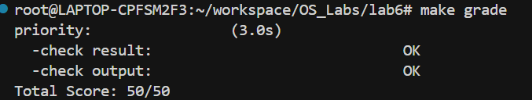

# 操作系统课程ucore Lab6

## 练习0：填写已有实验

已实现。

## 练习1：理解调度器框架的实现

### 调度类 `sched_class` 结构体：每个函数指针做什么、何时调用、为什么用函数指针

`sched_class` 的定义在 `lab6/kern/schedule/sched.h`：

```c++
struct sched_class
{
    const char *name;
    void (*init)(struct run_queue *rq);
    void (*enqueue)(struct run_queue *rq, struct proc_struct *proc);
    void (*dequeue)(struct run_queue *rq, struct proc_struct *proc);
    struct proc_struct *(*pick_next)(struct run_queue *rq);
    void (*proc_tick)(struct run_queue *rq, struct proc_struct *proc);
};
```

- **`name`**
  - **作用**：记录调度算法名字，并且打印。
  - **调用时机**：`sched_init()` 中会打印： `cprintf("sched class: %s\n", sched_class->name);`
- **`init(rq)`**
  - **作用**：初始化该调度算法需要的 `run_queue` 内部状态（比如初始化链表、清零计数、初始化斜堆根等）。
  - **调用时机**：`sched_init()` 里，在选择好 `sched_class` 后调用一次。
- **`enqueue(rq, proc)`**
  - **作用**：把一个可运行进程加入“就绪队列”。同时通常要：
    - 设置 `proc->rq = rq`
    - 初始化/重置 `proc->time_slice`
    - 把 `proc->run_link` 或 `proc->lab6_run_pool` 插入对应数据结构
    - `rq->proc_num++`
  - **调用时机**：
    - `wakeup_proc()`：把睡眠进程变成 runnable 后入队（若不是 current）
    - `schedule()`：当前进程若仍 runnable，会被重新入队（相当于“用完一次 CPU 后回到队尾/回到优先队列”）
- **`dequeue(rq, proc)`**
  - **作用**：把进程从就绪队列移除，并更新元数据（`rq->proc_num--` 等）。
  - **调用时机**：`schedule()` 选出 next 之后，会将 next 从队列移除（表示 next 即将运行）。
- **`pick_next(rq)`**
  - **作用**：从就绪队列里选出“下一次要运行”的进程（RR 就取队头；Stride 就取 stride 最小者）。
  - **调用时机**：`schedule()` 中挑选 next。
- **`proc_tick(rq, proc)`**
  - **作用**：时钟滴答（timer tick）到来时更新当前运行进程的调度状态（典型就是递减 `time_slice`，耗尽则置 `proc->need_resched=1`）。
  - **调用时机**：时钟中断处理里调用 `sched_class_proc_tick(current)`，再由它转调 `sched_class->proc_tick(rq, current)`。

**为什么要用“函数指针”而不是直接写死实现？**

- **核心原因：解耦**。`sched.c` 只负责“调度流程”（什么时候入队/出队/选人/切换），而**具体策略**（RR、Stride、将来更多算法）在各自模块里实现。
- **可扩展/可替换**：只要实现同样的一组接口（init/enqueue/dequeue/pick_next/proc_tick），就能“插入”新算法；切换算法通常只改 `sched_init()` 选哪个 `sched_class`。
- **避免大量 if/else 或宏**：不用在核心调度流程里写 `if (RR) ... else if (stride) ...`，否则会越写越复杂、难维护。
- **类 Linux 的“策略模式（Strategy Pattern）”**：这就是操作系统里很常见的设计方式。

### 运行队列 `run_queue`：lab5 vs lab6 差异；为何要同时支持“链表 + 斜堆”

lab6 的 `run_queue` 定义在 `lab6/kern/schedule/sched.h`：

```c++
struct run_queue
{
    list_entry_t run_list;
    unsigned int proc_num;
    int max_time_slice;
    skew_heap_entry_t *lab6_run_pool;
};
```

#### 2.1 lab5 和 lab6 的差异

- **lab5**：根本**没有**独立的 `run_queue` 抽象；`schedule()` 直接遍历全局 `proc_list` 找 `runnable` 的进程。
- **lab6**：引入 `run_queue`：
  - `run_list`：就绪队列的**链表表示**（最适合 RR：队尾入队、队头出队，O(1)）。
  - `lab6_run_pool`：就绪队列的**优先队列/斜堆表示**（最适合 Stride：每次取最小 stride，堆顶 O(1)，插入/删除对数或摊还较好）。
  - `proc_num`：就绪队列内进程数量。
  - `max_time_slice`：统一时间片上限（由框架设置，算法使用）。

另外，进程结构体 `proc_struct` 也为这两种结构准备了“节点”：

```c++
struct run_queue *rq;
list_entry_t run_link;
int time_slice;
skew_heap_entry_t lab6_run_pool;
uint32_t lab6_stride;
uint32_t lab6_priority;
```

#### 2.2 为什么 run_queue 需要支持两种数据结构（链表 + 斜堆）？

- **RR（时间片轮转）天然适合链表**：
  - 入队：插到队尾
  - 取下一个：取队头
  - 全是 O(1)
- **Stride（按“最小 stride”选）天然适合优先队列/堆**：
  - 需要频繁“取最小”，链表需要每次 O(n) 扫描；堆/斜堆更高效。
- **同一个框架要承载不同算法**：所以 `run_queue` 预留了两套结构的“承载位”。

### lab6 中 `sched_init()` / `wakeup_proc()` / `schedule()` 如何变化，如何与算法解耦

lab6 的核心框架实现（`lab6/kern/schedule/sched.c`）：

```c++
void sched_init(void)
{
    list_init(&timer_list);
    sched_class = &default_sched_class;
    rq = &__rq;
    rq->max_time_slice = MAX_TIME_SLICE;
    sched_class->init(rq);
    cprintf("sched class: %s\n", sched_class->name);
}
```

- **`sched_init()`**
  - 选择一个 `sched_class` 、准备 `rq`、 设置时间片上限、 调用算法自己的 `init`。
  - **解耦点**：框架不知道 RR/Stride 怎么初始化，只调用 `sched_class->init(rq)`。

```c++
void wakeup_proc(struct proc_struct *proc)
{
    ...
    if (proc->state != PROC_RUNNABLE) {
        proc->state = PROC_RUNNABLE;
        proc->wait_state = 0;
        if (proc != current) {
            sched_class_enqueue(proc);
        }
    }
    ...
}
```

- **`wakeup_proc()`**
  - lab5：只改状态 runnable。
  - lab6：改完状态后，把进程交给 `sched_class_enqueue()`（最终是算法的 enqueue）入队。
  - **解耦点**：入队细节（链表还是堆、插哪里、如何更新 stride）完全在调度算法里。

```c++
void schedule(void)
{
    ...
    current->need_resched = 0;
    if (current->state == PROC_RUNNABLE) {
        sched_class_enqueue(current);
    }
    if ((next = sched_class_pick_next()) != NULL) {
        sched_class_dequeue(next);
    }
    if (next == NULL) {
        next = idleproc;
    }
    next->runs++;
    if (next != current) {
        proc_run(next);
    }
    ...
}
```

- **`schedule()`**
  - lab5：遍历全局 `proc_list` 找 runnable。
  - lab6：只做“流程编排”：
    - current 若 runnable → 入队
    - pick_next → 选 next
    - dequeue(next) → 从队列移除
    - proc_run(next) → 上下文切换
  - **解耦点**：框架不关心“next 怎么选”，只调用 `pick_next`。具体的实现由调度算法实现。

### 调度类初始化流程（从内核启动到 sched_init 完成）

内核启动时的关键调用顺序在 `lab6/kern/init/init.c`：

```c++
vmm_init();
sched_init();
proc_init();
clock_init();
intr_enable();
cpu_idle();
```

流程描述：

- **内核初始化**：完成内存管理/中断等基础设施后
- **调用 `sched_init()`**：框架选择 `sched_class = &default_sched_class`，设置 `rq` 并调用 `default_sched_class.init(rq)` 完成算法私有初始化
- **`proc_init()`**：创建 `idleproc/initproc` 并设置 `current`
- **`clock_init()` + `intr_enable()`**：开启时钟中断与总中断
- **`cpu_idle()`**：进入 idle 循环，之后调度系统开始工作

**default_sched_class 如何关联到框架？**

- 在 `sched_init()` 里把 `sched_class` 指针指向 `default_sched_class`（RR 的实现），之后框架对 `sched_class->enqueue/pick_next/proc_tick...` 的调用就会落到 RR 模块。

### 进程调度完整流程图

#### 5.1 触发点：时钟中断里调用 proc_tick

在 `trap.c` 的时钟中断分支中调用：

```c++
case IRQ_S_TIMER:
    clock_set_next_event();
    ...
    sched_class_proc_tick(current);
    break;
```

`sched_class_proc_tick` 再转调具体算法的 `proc_tick`：

```c++
void sched_class_proc_tick(struct proc_struct *proc)
{
    if (proc != idleproc) {
        sched_class->proc_tick(rq, proc);
    } else {
        proc->need_resched = 1;
    }
}
```

#### 5.2 need_resched 在哪里触发 schedule？

`trap()` 在“从用户态返回时”检查 `need_resched` 并调用 `schedule()`：

```c++
if (!in_kernel) {
    ...
    if (current->need_resched) {
        schedule();
    }
}
```

#### 5.3 流程图

```c++
[硬件时钟到期]
      |
      v
[产生 IRQ_S_TIMER]
      |
      v
trap() -> trap_dispatch() -> interrupt_handler()
      |
      v
IRQ_S_TIMER 分支:
  - clock_set_next_event()
  - sched_class_proc_tick(current)
        |
        v
    if current != idleproc:
       sched_class->proc_tick(rq, current)
           |
           v
       (RR/Stride 算法内部)
       - 递减 time_slice
       - 若耗尽: current->need_resched = 1
       - (Stride 可能还会更新 stride/priority 相关信息)
      |
      v
从中断返回 -> 回到 trap()
      |
      v
若这是从用户态返回(!in_kernel) 且 current->need_resched==1:
      |
      v
schedule()
  - current->need_resched = 0
  - 若 current 仍 runnable: sched_class->enqueue(rq, current)
  - next = sched_class->pick_next(rq)
  - 若 next != NULL: sched_class->dequeue(rq, next)
  - 若 next==NULL: next = idleproc
  - 若 next != current: proc_run(next) (上下文切换)
```

**need_resched 的作用**

- 它是“延迟调度”的标志位：**在时钟中断里只做轻量标记（置位），真正的进程切换在更安全的时机（从用户态返回前）进行**。
- 这样做可以减少在中断上下文里做复杂切换的操作，也避免在内核关键区随意抢占。

### 调度算法切换机制：想加一个新的算法（stride）要改哪些代码？为什么切换很容易？

#### 6.1 添加/切换算法需要做什么

以“新增一个 stride 调度器”为例：

- **实现一个新的 `sched_class` 实例**（比如 `stride_sched_class`）：
  - 填好：`init/enqueue/dequeue/pick_next/proc_tick`
  - 使用 `rq->lab6_run_pool`（斜堆）和 `proc->lab6_stride/lab6_priority`
- **在 `sched_init()` 里切换选择**：
  - 把 `sched_class = &default_sched_class;` 改为 `sched_class = &stride_sched_class;`
  - 或者做成编译宏/配置项决定用哪个

#### 6.2 为什么这种设计让切换很容易？

因为框架与策略的边界非常清晰：

- 核心调度流程永远只调用这 5 个接口（init/enqueue/dequeue/pick_next/proc_tick）。
- 新算法只要“遵守接口契约”，就能被框架驱动起来。
- 切换算法的代价接近 O(1)：通常就是改一行 `sched_class = &xxx_sched_class`就能实现。

## 练习2：实现 Round Robin 调度算法

### 比较 lab5 与 lab6 中“同名但实现不同”的函数

选 `kern/schedule/sched.c` 里的 **`schedule()`**。

#### `schedule()`：lab5 vs lab6

- **lab5 的 `schedule()`**：在全局 `proc_list` 上从当前位置开始扫描，找第一个 `PROC_RUNNABLE` 的进程就切换；找不到就运行 `idleproc`。
- **lab6 的 `schedule()`**：不再扫描 `proc_list`，而是：
  - 若 `current` 仍 runnable，则 **enqueue(current)** 回就绪队列
  - **pick_next()** 从 **run_queue** 选择 next
  - **dequeue(next)** 把 next 从 run_queue 取出
  - 切到 next，否则切到 `idleproc`

#### 为什么要做这个改动？

lab6 引入了**调度器框架**（`sched_class` + `run_queue`），目标是让 RR/Stride 等算法“可插拔”。因此：

- **选择 next 的策略**不应该写死在 `schedule()` 里（否则每加一种算法都要改 `schedule()`）。
- `schedule()` 只做“流程编排”，具体策略交给 `sched_class->pick_next / enqueue / dequeue`。

#### 不改会出什么问题？

如果 lab6 仍用 lab5 那种“扫描 `proc_list`”：

- **调度算法无法解耦**：Stride 需要“取 stride 最小者”，扫描链表会变成 O(n) 并且逻辑会污染核心调度代码。
- **run_queue 形同虚设**：`enqueue/dequeue/pick_next` 这些接口没有用武之地，框架设计失效。
- 更严重一点：若在 `wakeup_proc()` 里只把进程标 runnable 但没有入队，而 `schedule()` 又改成只从 run_queue 取，那么 runnable 进程可能**永远取不到**，造成“进程饿死/系统假死”。这也是 lab6 的 `wakeup_proc()` 必须做 enqueue 的原因。

### RR 各函数实现思路（链表操作、宏、边界条件）

RR（Round Robin）在 lab6 中通过 `default_sched_class` 实现，核心思想是：**就绪队列用链表维护 FIFO**，时间片耗尽就触发重调度。

#### 1) `RR_init(struct run_queue *rq)`

- **目的**：把就绪队列初始化为空队列，计数清零。
- **做法**：
  - `list_init(&rq->run_list);`
  - `rq->proc_num = 0;`
- **边界**：初始化后 `run_list` 必须是空，否则 `pick_next` 取队头会出错。

#### 2) `RR_enqueue(struct run_queue *rq, struct proc_struct *proc)`

- **目的**：把 `proc` 放到就绪队列“队尾”，并分配时间片。
- **关键步骤**：
  - `proc->rq = rq;`
  - `proc->time_slice = rq->max_time_slice;`
  - **链表入队**：用 `list_add_before(&rq->run_list, &proc->run_link)`  
    - 解释：`run_list` 的头结点通常是哨兵节点，把元素插到哨兵**之前**等价于插到队尾（FIFO）。
- **边界条件**：
  - **重复入队**：通常要求 `proc` 没在任何队列里（可以用断言/检查 `proc->rq == NULL`）。
  - **idle 进程**：框架层 `sched_class_enqueue` 已经避免 enqueue `idleproc`。

#### 3) `RR_dequeue(struct run_queue *rq, struct proc_struct *proc)`

- **目的**：把某个进程从就绪队列摘掉。
- **关键步骤**：
  - `list_del_init(&proc->run_link);`  
    - 解释：`del_init` 会把节点从链表删除，并把它自己初始化成“单节点链表”，避免野指针/重复删除问题。
  - `proc->rq = NULL; rq->proc_num--;`
- **边界条件**：
  - 必须保证 `proc` 当前确实在这个 `rq` 里（否则删错链表会破坏队列）。

#### 4) `RR_pick_next(struct run_queue *rq)`

- **目的**：取出“队头”进程作为下一个运行者（注意 pick 只是“选择”，真正移除在 `dequeue`）。
- **关键点**：
  - **空队列**：若 `list_empty(&rq->run_list)` 返回 `NULL`。
  - **取队头节点**：`le = list_next(&rq->run_list);`
  - **用宏把链表节点转为进程指针**：`le2proc(le, run_link)`  
    - 解释：`le2proc` 会根据成员偏移把 `list_entry_t*` 还原成 `struct proc_struct*`。

#### 5) `RR_proc_tick(struct run_queue *rq, struct proc_struct *proc)`

- **目的**：每次时钟 tick 更新当前进程的时间片；耗尽则触发调度。
- **关键逻辑**：
  - `proc->time_slice--`（不小于 0）
  - 若 `proc->time_slice == 0`：`proc->need_resched = 1;`
- **边界条件**：
  - 时间片已经是 0 不应继续减成负数（所以一般写成“>0 才减”）。
  - `idleproc` 的处理：框架 `sched_class_proc_tick` 一般会让 idle 也触发 resched（确保系统能尽快切到可运行进程）。

### make grade输出结果分析



`make grade`输出结果如上（同级目录下的图片`mgresult.png`，如果路径正常可以正常显示）：

```bash
priority:                (3.0s)
  -check result:                             OK
  -check output:                             OK
Total Score: 50/50
```

`make qemu`输出如下：

```bash
PMP0: 0x0000000080000000-0x000000008001ffff (A)
PMP1: 0x0000000000000000-0xffffffffffffffff (A,R,W,X)
(THU.CST) os is loading ...

Special kernel symbols:
  entry  0xc020004a (virtual)
  etext  0xc02057c0 (virtual)
  edata  0xc02c2710 (virtual)
  end    0xc02c6bf0 (virtual)
Kernel executable memory footprint: 795KB
DTB Init
HartID: 0
DTB Address: 0x82200000
Physical Memory from DTB:
  Base: 0x0000000080000000
  Size: 0x0000000008000000 (128 MB)
  End:  0x0000000087ffffff
DTB init completed
memory management: default_pmm_manager
physcial memory map:
  memory: 0x08000000, [0x80000000, 0x87ffffff].
vapaofset is 18446744070488326144
check_alloc_page() succeeded!
check_pgdir() succeeded!
check_boot_pgdir() succeeded!
use SLOB allocator
kmalloc_init() succeeded!
check_vma_struct() succeeded!
check_vmm() succeeded.
sched class: RR_scheduler
++ setup timer interrupts
kernel_execve: pid = 2, name = "priority".
set priority to 6
main: fork ok,now need to wait pids.
set priority to 1
set priority to 2
set priority to 3
set priority to 4
set priority to 5
child pid 3, acc 808000, time 2010
child pid 4, acc 800000, time 2010
child pid 5, acc 792000, time 2010
child pid 6, acc 788000, time 2010
child pid 7, acc 796000, time 2010
main: pid 0, acc 808000, time 2010
main: pid 4, acc 800000, time 2010
main: pid 5, acc 792000, time 2010
main: pid 6, acc 788000, time 2010
main: pid 7, acc 796000, time 2010
main: wait pids over
sched result: 1 1 1 1 1
all user-mode processes have quit.
init check memory pass.
kernel panic at kern/process/proc.c:536:
    initproc exit.
```

QEMU 启动后关键现象如下：

- **调度器初始化成功**：
  - 打印：`sched class: RR_scheduler`
  - 说明当前调度类绑定的是 RR（Round Robin）那套接口。
- **时钟中断开启**：
  - 打印：`++ setup timer interrupts`
  - 之后系统开始依赖 timer tick 做抢占式调度（time_slice 用完会触发 resched）。
- **用户态测试程序运行**：
  - 打印：`kernel_execve: pid = 2, name = "priority".`，说明执行了pid为2、名为priority的进程。
  - 随后出现多次：`set priority to X`（X=1..6），说明测试在给不同进程设置“优先级参数”（用于 stride/priority 测试的输入）。这些进程是父进程`fork`得来，输出：`main: fork ok,now need to wait pids`
- **多个子进程完成运行并汇报统计量**：
  - 如：`child pid 3, acc 808000, time 2010` 等
  - 现象解释：
    - **多个 child（pid 3~7）都能得到 CPU 执行**，说明调度确实在发生，而不是单进程独占。
    - `time 2010` 基本一致，说明测试窗口一致；`acc`（累计获得的 CPU/计数）在不同 pid 间非常接近。
- **调度结果输出**：
  - `sched result: 1 1 1 1 1`
  - 这表示本次测试统计出来 **各个子进程获得 CPU 的比例/次数几乎相同**（接近均分）。
  - 结合你当前打印 `sched class: RR_scheduler`，这与 **RR 的公平轮转特性**一致：每个 runnable 进程轮流获得时间片，长期看比较均衡。
- **测试结束并通过收尾检查**：
  - `all user-mode processes have quit.`
  - `init check memory pass.`

### RR 算法优缺点 + 时间片调优 + 为什么要设置 `need_resched`

#### 优点

- **公平**：所有 runnable 进程按 FIFO 轮转，避免长期独占 CPU。
- **实现简单**：链表队列 + 时间片计数。
- **响应好（相对 FCFS）**：交互型任务不会被长任务长期压住。

#### 缺点

- **上下文切换开销**：时间片太小会导致频繁切换，浪费 CPU。
- **不区分优先级/不感知 I/O**：CPU 密集与交互任务一视同仁，可能影响交互体验或吞吐。
- **缓存/局部性差**：频繁切换会破坏 cache 热数据。

#### 时间片如何调优（max_time_slice）

- **更小时间片**：
  - 更好交互响应，但切换开销更大，总吞吐可能下降。
- **更大时间片**：
  - 切换少、吞吐更好，但交互响应变差，“像批处理系统”。
- 实务上会选一个折中，并可根据负载动态调整。

#### 为什么必须在 `RR_proc_tick` 里设置 `need_resched`

- 因为 **真正的调度发生在安全点**（例如从 trap 返回用户态前），而 tick 中断里只应该快速更新状态：
  - `need_resched=1` 是“请求切换”的标志
  - trap 返回路径看到它才会调用 `schedule()` 完成切换
- 没有 `need_resched`：时间片耗尽也不会触发切换，RR 就失效，某个进程可能一直跑（直到主动让出/阻塞）。

### 拓展思考

#### 如果要实现“优先级 RR”，代码怎么改？

- **多队列 RR**：
  - 把 `run_queue` 变成 `run_list[PRIO_MAX]`（每个优先级一个链表）+ `bitmap` 或记录最高非空优先级。
  - `enqueue`：按 `proc->priority` 入对应队列尾部
  - `pick_next`：从高到低找第一个非空队列取队头
  - `time_slice`：可随优先级调整（高优先级更大/更小都可，看策略）
- **单队列但按优先级插入**（不如多队列清晰）：
  - 入队时按优先级插入合适位置，保持队列按优先级分段；但维护成本高。

#### 当前实现是否支持多核（SMP）调度？如何改进？

**不支持真正 SMP 调度**：

- 全局只有一个 `rq`（`static struct run_queue *rq;`）和一个 `sched_class`，假设单核。
- `sched_class` 里也注释了 “for SMP support in the future load_balance …”。

要支持 SMP，通常需要：

- **每核一个 run_queue**（per-CPU rq），避免多核抢同一把锁。
- `current`/`idleproc` 等也需要 per-CPU 概念。
- 增加 `load_balance`/`get_proc` 等接口，做核间迁移。
- 更严格的并发控制（rq_lock、关中断粒度、跨核 IPI 触发 resched 等）。

## 扩展练习 Challenge 1：实现 Stride Scheduling 调度算法

## 扩展练习 Challenge 2：更多调度算法及分析

> 在ucore上实现尽可能多的各种基本调度算法(FIFO, SJF,...)，并设计各种测试用例，能够定量地分析出各种调度算法在各种指标上的差异，说明调度算法的适用范围

