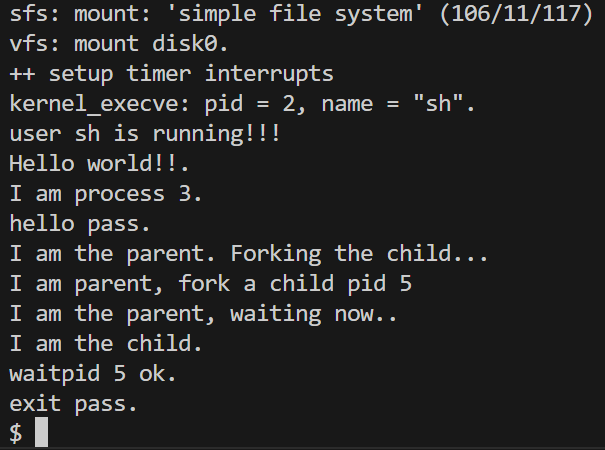

# 操作系统课程ucore Lab8

## 练习0：填写已有实验

已完成。

## 练习1：完成读文件操作的实现

### 1. 打开文件（open）的处理流程概览

用户态调用 `open(path, flags)` 后，经由系统调用进入内核，核心调用链如下：

- 用户态封装：`sys_open` → [user/libs/syscall.c](file:///home/lin/workspace/OS_Labs/lab8/user/libs/syscall.c)
- 系统调用分发：`SYS_open` → [kern/syscall/syscall.c](file:///home/lin/workspace/OS_Labs/lab8/kern/syscall/syscall.c)
- 内核 sysfile 层：`sysfile_open(path, flags)` → [kern/fs/sysfile.c](file:///home/lin/workspace/OS_Labs/lab8/kern/fs/sysfile.c)
- 进程文件表层：`file_open(path, flags)` 分配 fd 表项并调用 VFS → [kern/fs/file.c](file:///home/lin/workspace/OS_Labs/lab8/kern/fs/file.c#L155-L193)
- VFS 路径解析与打开：`vfs_open(path, flags, &inode)` → [vfsfile.c](file:///home/lin/workspace/OS_Labs/lab8/kern/fs/vfs/vfsfile.c#L10-L64)
  - `vfs_lookup(path, &inode)`：根据路径找到 inode → [vfslookup.c](file:///home/lin/workspace/OS_Labs/lab8/kern/fs/vfs/vfslookup.c#L67-L85)
  - 最终调用具体文件系统的 `vop_lookup`，在 SFS 中对应 `sfs_lookup`/`sfs_lookup_once`，并在需要时 `sfs_load_inode` 从磁盘把 inode 读入内存 → [sfs_inode.c](file:///home/lin/workspace/OS_Labs/lab8/kern/fs/sfs/sfs_inode.c#L154-L189)、[sfs_inode.c](file:///home/lin/workspace/OS_Labs/lab8/kern/fs/sfs/sfs_inode.c#L489-L512)、[sfs_inode.c](file:///home/lin/workspace/OS_Labs/lab8/kern/fs/sfs/sfs_inode.c#L997-L1022)

以上流程的结果是：内核得到一个可操作的 `inode`，并在当前进程的 fd 表里建立一项，返回文件描述符 fd 给用户态。

### 2. 读文件（read）的处理流程概览

用户态调用 `read(fd, buf, len)` 后，核心调用链如下：

- 系统调用：`SYS_read` → `sysfile_read(fd, base, len)` → [sysfile.c](file:///home/lin/workspace/OS_Labs/lab8/kern/fs/sysfile.c#L60-L105)
  - `sysfile_read` 使用内核缓冲区分段读取（IOBUF_SIZE），每次调用 `file_read`，再将数据 `copy_to_user` 拷贝到用户地址空间
- 进程文件表层：`file_read(fd, base, len, &copied)` → `vop_read(file->node, iob)` → [file.c](file:///home/lin/workspace/OS_Labs/lab8/kern/fs/file.c#L207-L231)
- SFS 文件读：`sfs_read(node, iob)` → `sfs_io(node, iob, 0)` → `sfs_io_nolock(...)` → [sfs_inode.c](file:///home/lin/workspace/OS_Labs/lab8/kern/fs/sfs/sfs_inode.c#L675-L706)

其中，本练习需要补全的是 `sfs_io_nolock` 在读文件时“如何把文件偏移映射到磁盘块并搬运到内存缓冲区”的逻辑。

### 3. sfs_io_nolock() 读实现思路

```c++
    int ret = 0;
    size_t size, alen = 0;
    uint32_t ino;
    off_t start_offset = offset;                  // 起始偏移：表示用户希望从文件哪里开始读/写（不随循环推进）
    off_t cur_offset = offset;                    // 当前偏移：表示本次读/写推进到哪里（循环过程中会不断增加）
    uint32_t blkno = cur_offset / SFS_BLKSIZE;          // The NO. of Rd/Wr begin block
    uint32_t nblks = endpos / SFS_BLKSIZE - blkno;      // The size of Rd/Wr blocks

  //LAB8:EXERCISE1 YOUR CODE HINT: call sfs_bmap_load_nolock, sfs_rbuf, sfs_rblock,etc. read different kind of blocks in file
    blkoff = cur_offset % SFS_BLKSIZE;            // 在首个块内的偏移（决定是否需要先处理“首块非对齐”）
    char *cbuf = buf;
    if (blkoff != 0) {
        // (1) 首块非对齐：只读/写从 cur_offset 到该块末尾（或到 endpos 为止）
        size = (nblks != 0) ? (SFS_BLKSIZE - blkoff) : (endpos - cur_offset);
        if ((ret = sfs_bmap_load_nolock(sfs, sin, blkno, &ino)) != 0) {
            goto out;
        }
        if ((ret = sfs_buf_op(sfs, cbuf, size, ino, blkoff)) != 0) {
            goto out;
        }
        alen += size;
        cbuf += size;
        cur_offset += size;
        blkno++;
        if (nblks != 0) {
            nblks--;
        }
    }
    while (nblks != 0) {
        // (2) 中间整块：优先合并连续的物理块，一次性调用 sfs_block_op 读/写多个块，提高效率
        size_t run_blks = 0;
        uint32_t run_ino = 0;
        while (run_blks < nblks) {
            if ((ret = sfs_bmap_load_nolock(sfs, sin, blkno + run_blks, &ino)) != 0) {
                goto out;
            }
            if (run_blks == 0) {
                run_ino = ino;
                run_blks = 1;
                continue;
            }
            if (ino != run_ino + run_blks) {
                break;
            }
            run_blks++;
        }
        if ((ret = sfs_block_op(sfs, cbuf, run_ino, run_blks)) != 0) {
            goto out;
        }
        size = run_blks * SFS_BLKSIZE;
        alen += size;
        cbuf += size;
        cur_offset += size;
        blkno += run_blks;
        nblks -= run_blks;
    }
    size = endpos - cur_offset;
    if (size != 0) {
        // (3) 末块非对齐：只读/写最后一个块的前 size 字节
        if ((ret = sfs_bmap_load_nolock(sfs, sin, blkno, &ino)) != 0) {
            goto out;
        }
        if ((ret = sfs_buf_op(sfs, cbuf, size, ino, 0)) != 0) {
            goto out;
        }
        alen += size;
    }
out:
    *alenp = alen;
    if (start_offset + alen > sin->din->size) {
        // 注意：这里必须用起始偏移 start_offset（不能用已经推进过的 cur_offset），否则会把 alen 计算重复
        sin->din->size = start_offset + alen;
        sin->dirty = 1;
    }
    return ret;
}
```

`sfs_io_nolock(sfs, sin, buf, offset, alenp, write)` 的职责是：以 `offset` 为起点，在 SFS 文件中读/写最多 `*alenp` 字节到/从内存 `buf`，并把实际完成字节数写回 `*alenp`。

读文件时（`write==0`）的关键处理如下（实现见上面的代码）：

- 边界裁剪
  - `offset` 越界、`offset > endpos` 直接返回 `-E_INVAL`
  - 读操作不允许越过文件末尾：若 `offset >= din->size` 返回 0；若 `endpos > din->size` 则把 `endpos` 截断到 `din->size`
- 按“首块非对齐 + 中间整块 + 末块非对齐”三段处理
  - 首块非对齐：若 `offset % SFS_BLKSIZE != 0`，先读该块内剩余的部分。用 `sfs_bmap_load_nolock` 将逻辑块号映射到磁盘块号，再用 `sfs_rbuf` 从块内偏移处拷贝出指定字节数
  - 中间整块：对齐后的整块区间，使用 `sfs_rblock` 进行块级读取。实现中额外做了“连续物理块合并”，把一段连续块合并成一次 `sfs_rblock` 调用以减少 I/O 次数
  - 末块非对齐：若末尾还剩不足一块的字节数，映射最后一个逻辑块并用 `sfs_rbuf` 从块起始处读取
- 返回值与实际读出长度
  - 每次成功读一段就推进 `buf/offset` 并累加 `alen`
  - 最终把实际完成字节数写回 `*alenp`

与读实现配套使用的底层接口为：

- `sfs_bmap_load_nolock`：把“文件逻辑块号”映射到“磁盘块号” → [sfs_inode.c](file:///home/lin/workspace/OS_Labs/lab8/kern/fs/sfs/sfs_inode.c#L353-L371)
- `sfs_rbuf`：读“块内的一段”（非对齐读）→ [sfs_io.c](file:///home/lin/workspace/OS_Labs/lab8/kern/fs/sfs/sfs_io.c#L74-L94)
- `sfs_rblock`：读“整块/多块”（对齐读）→ [sfs_io.c](file:///home/lin/workspace/OS_Labs/lab8/kern/fs/sfs/sfs_io.c#L1-L49)


## 练习2：完成基于文件系统的执行程序机制的实现

> 改写proc.c中的load_icode函数和其他相关函数，实现基于文件系统的执行程序机制。执行：make qemu。如果能看看到sh用户程序的执行界面，则基本成功了。如果在sh用户界面上可以执行exit, hello（更多用户程序放在user目录下）等其他放置在sfs文件系统中的其他执行程序，则可以认为本实验基本成功。

本练习的本质上是将 uCore 中“执行用户程序”的机制，从 **LAB5 中依赖内存中固化二进制的方式**，改造为 **通过文件系统按路径加载 ELF 并执行**。

### 1. 整体执行链路

在本次实验中，用户态程序（如 `sh`）通过 `exec(path, argv)` 请求内核执行新程序。系统调用进入内核后，经由`SYS_exec → sys_exec → do_execve(name, argc, argv)`完成参数处理与资源整理。随后 `do_execve` 使用文件系统接口 `sysfile_open` 打开路径对应的可执行文件，得到文件描述符 `fd`，并调用 `load_icode(fd, argc, kargv)` 完成 ELF 装载。

`load_icode` 在内核态为当前进程建立全新的用户地址空间，装载程序段、构造用户栈与参数，并设置好 trapframe。当内核通过 trap 返回路径离开后，CPU 切换到用户态，从 ELF 入口地址开始执行新程序。该链路跑通后，用户在 `sh` 中输入命令即可触发完整的 exec 流程。

### 2. do_execve：作为 exec 的准备阶段

这个函数的职责本质上就是“为装载新程序清场并准备安全环境”。在实现中，它首先检查 `argc` 的合法性，并通过 `copy_string` / `copy_kargv` 把程序名与参数从用户空间拷贝到内核缓冲区。这一步的目的是避免在后续释放旧用户地址空间后，内核仍访问失效的用户指针。

随后，`do_execve` 关闭当前进程打开的文件（本实验中采用全部关闭的简化策略），并使用 `argv[0]` 作为路径调用 `sysfile_open` 打开可执行文件。若当前进程已有用户地址空间，则先切回内核页表，再按引用计数依次释放旧的用户映射、页表和 `mm_struct`，使进程回到“空壳待装载”的状态。完成这些准备后，`do_execve` 调用 `load_icode` 进入真正的装载阶段。

### 3. load_icode：从文件系统装载 ELF 并建立用户环境

`load_icode` 是本练习的核心。其核心目标是 **为 CPU 构造一个可以直接运行用户程序的完整用户环境**。实现上，函数首先创建新的 `mm_struct` 并建立页表根，保留必要的内核映射。随后通过`load_icode_read`（基于 `fd` 的带偏移读封装）读取并校验 ELF Header，再遍历 Program Header 表，仅处理 `PT_LOAD` 段。对每个可加载段，我们根据 ELF 的段权限生成对应的 `vm_flags` 和页表权限，先用 `mm_map` 建立 vma，再按页分配物理内存并将文件中的段内容读入；对 `filesz` 之外的部分（BSS）则显式清零。

完成各段装载后，`load_icode` 建立用户栈的 vma，并在栈顶向下布局参数字符串和 `argv` 指针数组，完成必要的对齐。为了避免在 exec 路径中触发缺页异常，我们会提前分配覆盖到的栈页。随后将新建的 `mm` 安装到当前进程并切换页表（更新 satp/CR3 并刷新 TLB），在新地址空间下把参数字符串和指针数组真正写入用户栈。

最后，函数重置当前进程的 trapframe：设置 `epc` 为 ELF 入口地址，`sp` 为用户栈顶，并按调用约定把 `argc` 和 `argv` 地址放入寄存器，同时清除特权级相关标志以确保 trap 返回后进入用户态。至此，`load_icode` 完成，内核返回后新程序即可开始执行。

